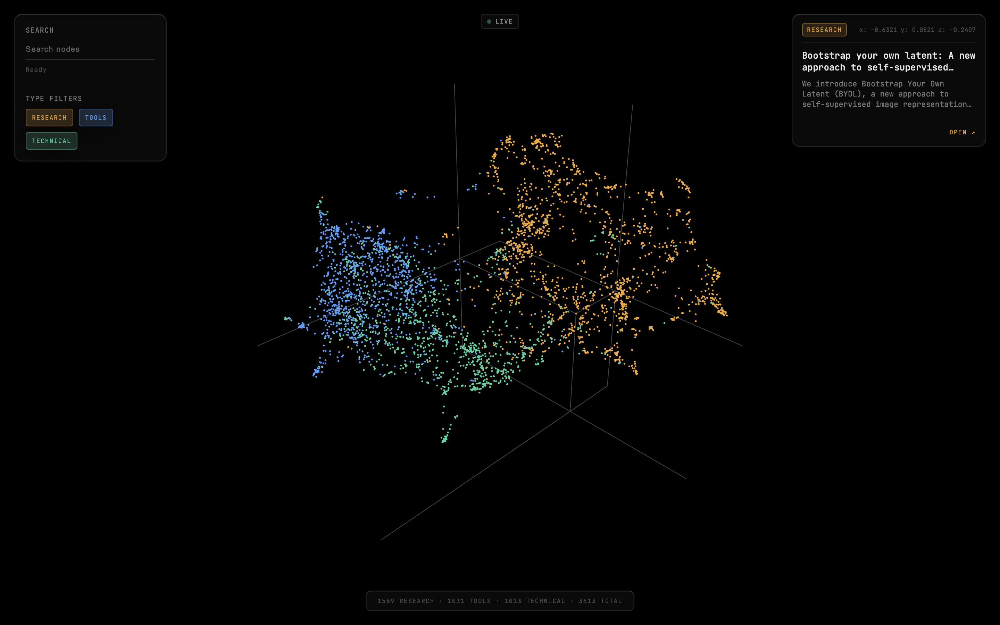

A visual map of AI, specifically of research, tools (commercial/practical) and technical code in the space.



## How do I launch this awesome, cool interface?

First, you'll run the following code to install all packages:

```
npm install
pip install -r requirements.txt
```

You'll find existing data inside ./data/, therefore you are welcome to skip this step. However, if you want to resource all data, we do so in two steps. First step is to source titles and descriptions of each resource. This code is contained in source.py. Run:

```
python source.py --force
```

If you want to resource a specific type of resource (from a pool of three: research, technical, tool), run:

```
python source.py --force --type [RESOURCE_TYPE: research/techical/tool]
```

Then run (this step takes the longest):

```
python embed.py
```

Finally, run:

```
npm run build
npm run dev
```

If you would like live updates, instead of the `npm run dev`, run the below:

```
python worker.py
uvicorn server:app --host 0.0.0.0 --port 3000
```

